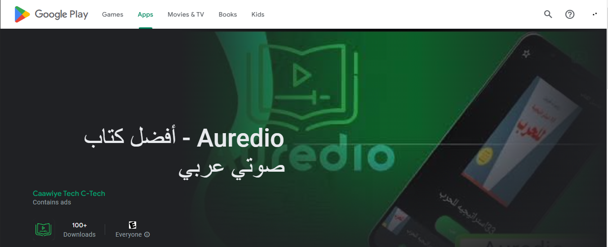
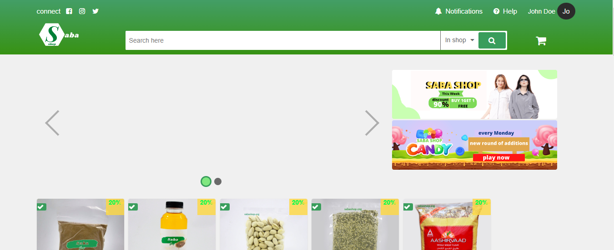

 

<h1 align="center">Hi 👋, I'm Mina</h1>

<h4 align="center">to make a long story short I’m a full stack Web Developer
                and App Developer, I like talking about fun topics and working with
                a team. I specialize in JS and React but I try to do other programming languages and frameworks :)</h4>

- 🔭 I’m currently working on [an app, a website and a game]()

- 🌱 I’m currently learning **Go & PostgreSQL & Godot**

- 📫 How to reach me **marminamina3@gmail.com**

- 💭 Here is where my noodle code is stored so I can work on them later on.

---

<h1 align="center">TECHNOLOGY I'VE TOUCHED</h1>

                 <a href="https://vuejs.org/" target="_blank" rel="noreferrer"> 

---

<h1 align="center">STATS FOR NERDS</h1>

  

  
  

&nbsp;

---
<h1 align="center">PROJECTS</h1>

<h4>1. Audio book app: </h4>

<h4>2. E-commerce website (Archived) </h4>

<h6 align="center">Check out my repo for more projects I or a team im apart of made :D</h6>

  
---

<h1 align="center">SOCIAL</h1>

---

<h6 align="center">Made with ❤️ by Me</h6>

---

